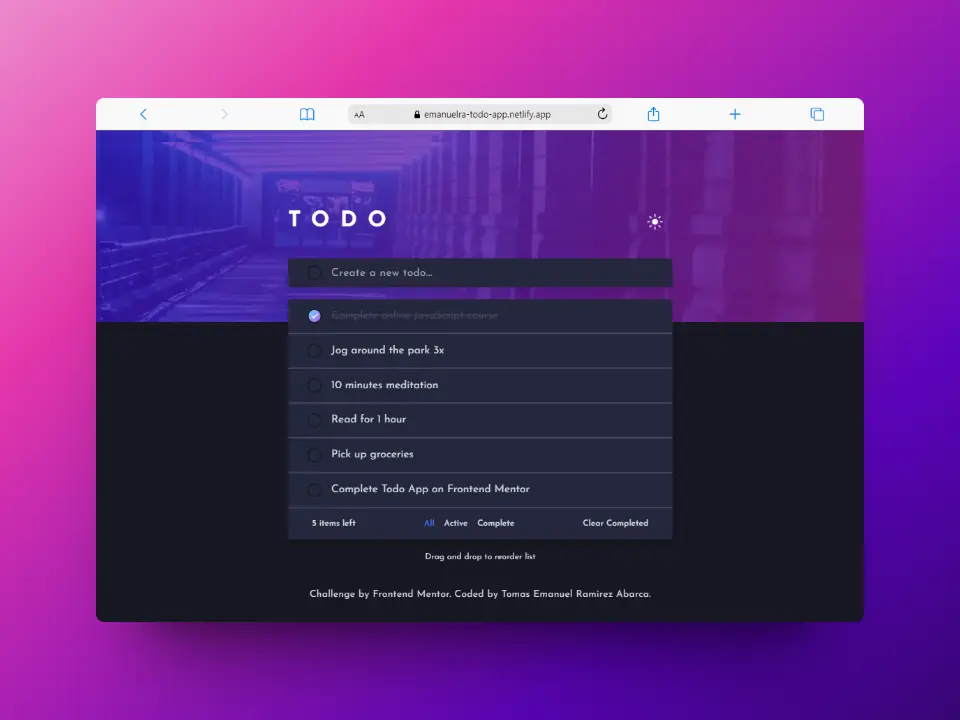
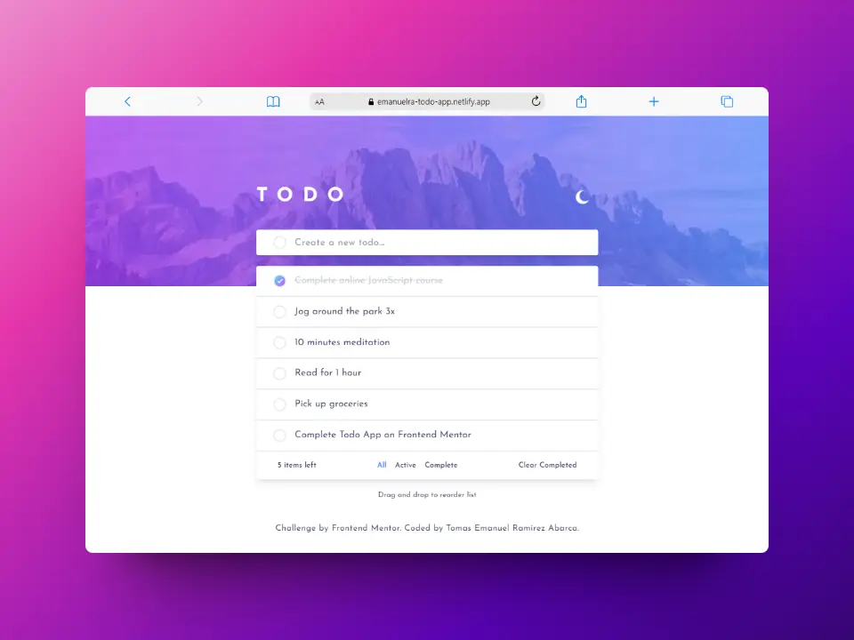
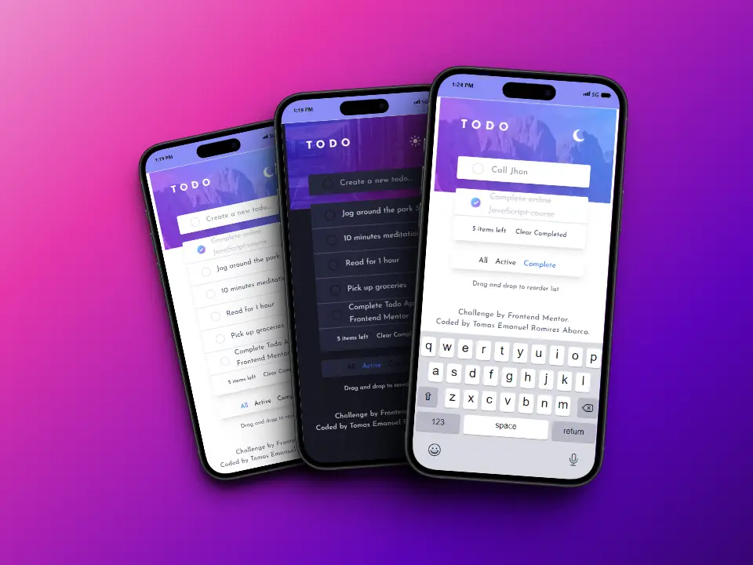

# Frontend Mentor - Todo app solution 🐱‍🏍

This is a solution to the [Todo app challenge on Frontend Mentor](https://www.frontendmentor.io/challenges/todo-app-Su1_KokOW). Frontend Mentor challenges help you improve your coding skills by building realistic projects.

## Table of contents

- [Overview](#overview)
  - [The challenge](#the-challenge)
  - [Screenshot](#screenshot)
  - [Links](#links)
- [My process](#my-process)
  - [Built with](#built-with)
  - [What I learned](#what-i-learned)
- [Author](#author)
- [Run Locally](#run-locally)

## Overview

### The challenge

Users should be able to:

- [x] View the optimal layout for the app depending on their device's screen size
- [x] See hover states for all interactive elements on the page
- [x] Add new todos to the list
- [x] Mark todos as complete
- [x] Delete todos from the list
- [x] Filter by all/active/complete todos
- [x] Clear all completed todos
- [x] Toggle light and dark mode
- [x] **Bonus**: Drag and drop to reorder items on the list

### Screenshot





### Links

- Live Site URL: [netlify](https://emanuelra-todo-app.netlify.app/)

## My process

### Built with

- Semantic HTML5 markup
- Flexbox
- [React](https://reactjs.org/) - JS library
- [TypeScript](https://www.typescriptlang.org/) - Typed programming language
- [Tailwindcss](https://tailwindcss.com/) - For styles
- [Zustand](https://zustand-demo.pmnd.rs/) - State management
- [Drag and Drop](https://drag-and-drop.formkit.com/) - JavaScript library
- [ViteJs](https://vitejs.dev/) - Build tool

### What I learned

For this challenge i have to lear about drag and drop, for re-order the items on the list

To handle the state with zustand, i use this code

```js
interface TodoState {
  todos: Todo[];
  addTodo: ({ todo, status }: { todo: string; status: Status }) => void;
  updateTodos: ({ todos }: { todos: Todo[] }) => void;
  updateStatus:({todo}:{todo:Todo})=>void
  deleteTodo: (id:string) => void
  clearComplete: ()=>void
}

export const useTodoStore = create<TodoState>()(
  persist(
    (set, get) => {
      return {
        todos: data,
        addTodo: ({ todo, status }: { todo: string; status: Status }) => {
          const { todos } = get();

          const clone = structuredClone(todos);

          const newTodo: Todo = {
            id: self.crypto.randomUUID(),
            todo: todo,
            status: status,
          };

          clone.push(newTodo);

          set({ todos: clone });
        },
        updateTodos: ({ todos }: { todos: Todo[] }) => {
          set({ todos });
        },
        updateStatus: ({ todo }: { todo: Todo }) => {
          const { todos } = get();
          const index = todos.findIndex((item) => item.id === todo.id);
          const clone = structuredClone(todos);

          clone[index].status =
            todo.status === 'active' ? 'complete' : 'active';

          set({ todos: clone });
        },
        deleteTodo: (id: string) => {
          const { todos } = get();
          const newTodos = todos.filter((todo) => todo.id !== id);
          set({ todos: newTodos });
        },
        clearComplete:()=>{
          const { todos } = get()
          const newTodos = todos.filter(todo => todo.status === 'active')
          set({todos:newTodos})
        }
      };
    },
    { name: 'FRONTEND::MENTOR::TODO:LIST' }
  )
);
```

To change the order of the list with drag and drop i use this code

```js

const dragHandlerPlugin: DNDPlugin = (parent) => {
  const parentData = parents.get(parent);
  if (!parentData) return;

  function dragend() {
    const items = document.getElementsByClassName(
      "todoItem"
    ) as HTMLCollectionOf<HTMLLIElement>;
    const list = Array.from(items).map((item) => item);
    const NewTodos: ITodo[] = [];
    list.map((li) => {
      const TODO: ITodo = {
        id: li.dataset.id as string,
        todo: li.dataset.todo as string,
        status: li.dataset.status as Status,
      };
      NewTodos.push(TODO);
    });
    updateTodos({ todos: NewTodos });
  }

  return {
    setup() {},
    teardown() {},
    setupNode(data) {
      data.nodeData.abortControllers.customPlugin = addEvents(data.node, {
        dragend: dragend,
      });
    },
    tearDownNode(data) {
      if (data.nodeData?.abortControllers?.customPlugin) {
        data.nodeData?.abortControllers?.customPlugin.abort();
      }
    },
    setupNodeRemap() {},
    tearDownNodeRemap() {},
  };
};

const [parent, list, setList] = useDragAndDrop<HTMLUListElement, ITodo>(
  todos,
  {
    draggable: (el) => {
      return el.id !== "no-drag";
    },
    plugins: [animations(), dragHandlerPlugin],
  }
);
```

## Author

- Github - [emanuel-ra](https://github.com/emanuel-ra/)
- Frontend Mentor - [@emanuel-ra](https://www.frontendmentor.io/profile/emanuel-ra)
- Linkedin - [@emanuelramirezabarca](https://www.linkedin.com/in/emanuelramirezabarca/)

## Run Locally

Clone the project

```bash
  git git@github.com:emanuel-ra/Todo-app.git
```

Go to the project directory

```bash
  cd app
```

Install dependencies

```bash
pnpm install
```

Start the server

```bash
pnpm run dev
```
